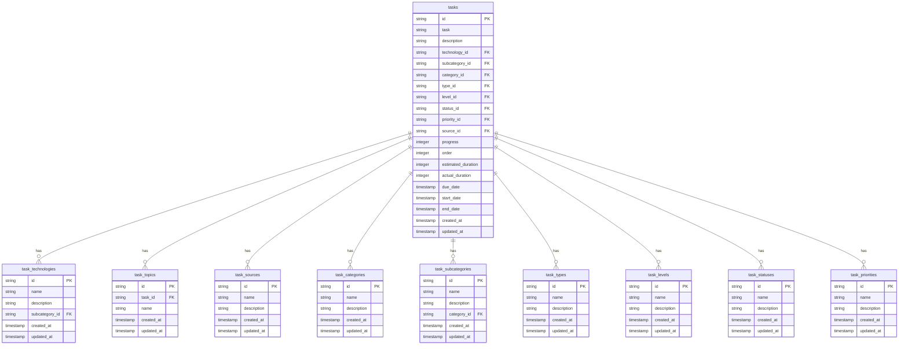

```mermaid
erDiagram
    tasks ||--o{ task_technologies : has
    tasks ||--o{ task_topics : has
    tasks ||--o{ task_sources : has
    tasks ||--o{ task_categories : has
    tasks ||--o{ task_subcategories : has
    tasks ||--o{ task_types : has
    tasks ||--o{ task_levels : has
    tasks ||--o{ task_statuses : has
    tasks ||--o{ task_priorities : has

    tasks {
        string id PK
        string task
        string description
        string technology_id FK
        string subcategory_id FK
        string category_id FK
        string type_id FK
        string level_id FK
        string status_id FK
        string priority_id FK
        string source_id FK
        integer progress
        integer order
        integer estimated_duration
        integer actual_duration
        timestamp due_date
        timestamp start_date
        timestamp end_date
        timestamp created_at
        timestamp updated_at
    }

    task_technologies {
        string id PK
        string name
        string description
        string subcategory_id FK
        timestamp created_at
        timestamp updated_at
    }

    task_subcategories {
        string id PK
        string name
        string description
        string category_id FK
        timestamp created_at
        timestamp updated_at
    }

    task_categories {
        string id PK
        string name
        string description
        timestamp created_at
        timestamp updated_at
    }

    task_types {
        string id PK
        string name
        string description
        timestamp created_at
        timestamp updated_at
    }

    task_levels {
        string id PK
        string name
        string description
        timestamp created_at
        timestamp updated_at
    }

    task_statuses {
        string id PK
        string name
        string description
        timestamp created_at
        timestamp updated_at
    }

    task_priorities {
        string id PK
        string name
        string description
        timestamp created_at
        timestamp updated_at
    }

    task_sources {
        string id PK
        string name
        string description
        timestamp created_at
        timestamp updated_at
    }

    task_topics {
        string id PK
        string task_id FK
        string name
        timestamp created_at
        timestamp updated_at
    }
``` 